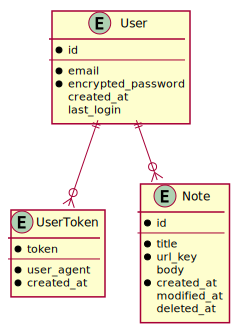

# simpleNOTE

A simple notepad full stack to explore best practices

This repo should contain sub-repos that explore the following areas:

- Backend using Rust, Postgres and GraphQL
- Web frontend using Preact, Material-UI and PWA
- iOS native app using SwiftUI
- Android native app

All of these should be using current best practices and help me to explore these technologies.

## Why a notepad?

Everyone does a TODO app, with is a list of tasks. A bit more useful to me is an app where I can jot down my ideas or other notes.

## Data Model

